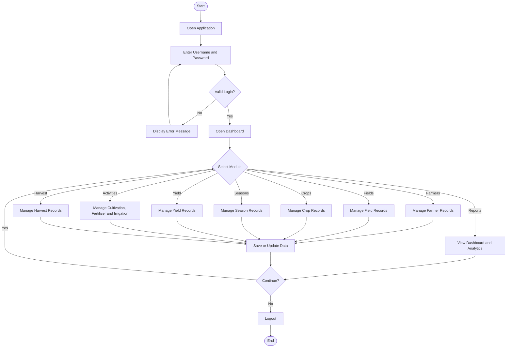

# Activity Diagram

```mermaid
flowchart TD
    A([Start]) --> B[Open Application]
    B --> C[Enter Username and Password]
    C --> D{Valid Login?}
    D -->|No| E[Display Error Message]
    E --> C
    D -->|Yes| F[Open Dashboard]
    F --> G{Select Module}
    G -->|Farmers| H[Manage Farmer Records]
    G -->|Fields| I[Manage Field Records]
    G -->|Crops| J[Manage Crop Records]
    G -->|Seasons| K[Manage Season Records]
    G -->|Yield| L[Manage Yield Records]
    G -->|Activities| M[Manage Cultivation, Fertilizer and Irrigation]
    G -->|Harvest| N[Manage Harvest Records]
    G -->|Reports| O[View Dashboard and Analytics]
    H --> P[Save or Update Data]
    I --> P
    J --> P
    K --> P
    L --> P
    M --> P
    N --> P
    O --> Q{Continue?}
    P --> Q
    Q -->|Yes| G
    Q -->|No| R[Logout]
    R --> S([End])
```
