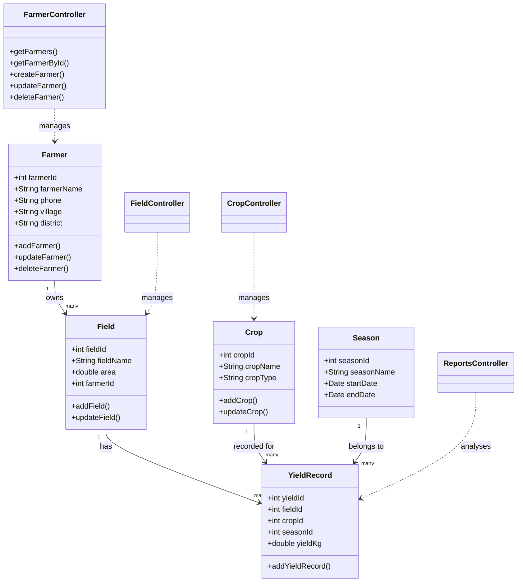

# UML Class Diagram

```mermaid
classDiagram
    class Farmer {
        +int farmerId
        +String farmerName
        +String phone
        +String village
        +String district
        +addFarmer()
        +updateFarmer()
        +deleteFarmer()
    }
    class Field {
        +int fieldId
        +String fieldName
        +double area
        +int farmerId
        +addField()
        +updateField()
    }
    class Crop {
        +int cropId
        +String cropName
        +String cropType
        +addCrop()
        +updateCrop()
    }
    class Season {
        +int seasonId
        +String seasonName
        +Date startDate
        +Date endDate
    }
    class YieldRecord {
        +int yieldId
        +int fieldId
        +int cropId
        +int seasonId
        +double yieldKg
        +addYieldRecord()
    }
    class FarmerController {
        +getFarmers()
        +getFarmerById()
        +createFarmer()
        +updateFarmer()
        +deleteFarmer()
    }
    class FieldController
    class CropController
    class ReportsController
    Farmer "1" --> "many" Field : owns
    Field "1" --> "many" YieldRecord : has
    Crop "1" --> "many" YieldRecord : recorded for
    Season "1" --> "many" YieldRecord : belongs to
    FarmerController ..> Farmer : manages
    FieldController ..> Field : manages
    CropController ..> Crop : manages
    ReportsController ..> YieldRecord : analyses
```
