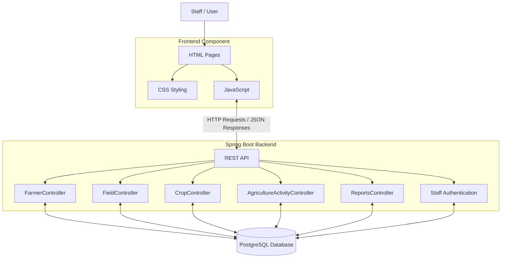

# Component Diagram

```mermaid
flowchart TB
    Staff["Staff / User"]
    subgraph Frontend["Frontend Component"]
        UI["HTML Pages"]
        CSS["CSS Styling"]
        JS["JavaScript"]
    end
    subgraph Backend["Spring Boot Backend"]
        API["REST API"]
        FC["FarmerController"]
        FIC["FieldController"]
        CC["CropController"]
        AAC["AgricultureActivityController"]
        RC["ReportsController"]
        AUTH["Staff Authentication"]
    end
    DB[("PostgreSQL Database")]
    Staff --> UI
    UI --> CSS
    UI --> JS
    JS <-->|HTTP Requests / JSON Responses| API
    API --> FC
    API --> FIC
    API --> CC
    API --> AAC
    API --> RC
    API --> AUTH
    FC <--> DB
    FIC <--> DB
    CC <--> DB
    AAC <--> DB
    RC <--> DB
    AUTH <--> DB
```
