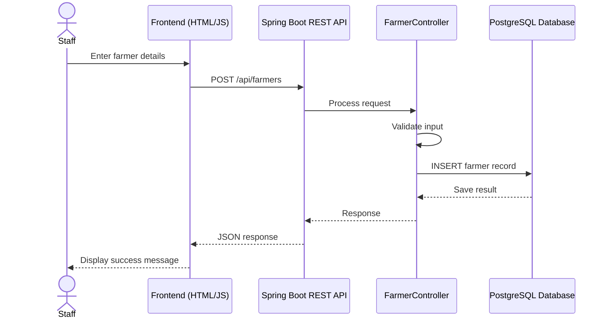

# Sequence Diagram

```mermaid
sequenceDiagram
    actor Staff
    participant UI as Frontend (HTML/JS)
    participant API as Spring Boot REST API
    participant Controller as FarmerController
    participant DB as PostgreSQL Database

    Staff->>UI: Enter farmer details
    UI->>API: POST /api/farmers
    API->>Controller: Process request
    Controller->>Controller: Validate input
    Controller->>DB: INSERT farmer record
    DB-->>Controller: Save result
    Controller-->>API: Response
    API-->>UI: JSON response
    UI-->>Staff: Display success message
```
